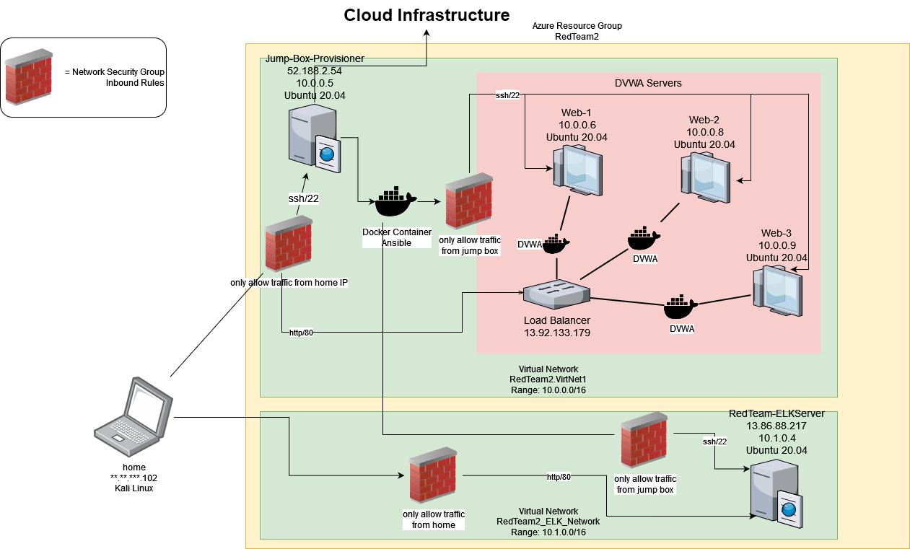
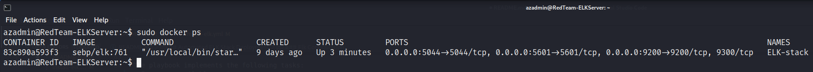

## Automated ELK Stack Deployment

The files in this repository were used to configure the network depicted below.



These files have been tested and used to generate a live ELK deployment on Azure. They can be used to either recreate the entire deployment pictured above. Alternatively, select portions of the _____ file may be used to install only certain pieces of it, such as Filebeat.

- [webservers](Ansible/webservers.yml)
- [install-elk.yml](Ansible/install-elk.yml)
- [filebeat-playbook.yml](Ansible/beats/filebeat-playbook.yml)
- [metricbeat-playbook.yml](Ansible/beats/metricbeat-playbook.yml)

This document contains the following details:
- [How to Use This Repository](#how-to-use-this-repository)
- [Description of the Topology](#description-of-the-topology)
- [Access Policies](#access-policies)
- [ELK Configuration](#elk-configuration)
  - Beats in Use
  - Machines Being Monitored
- [How to Use the Ansible Build](#using-the-playbook)

### How to Use This Repository

All commands assume you're using a Debian flavor of Linux, and are meant as an example of one possible setup. Adjust as needed.

#### Download your first copy
1. Install git:
```sudo apt install git```
2. Move to the desired directory to copy these files:
```cd ~/repositories```
3. Clone the repo:
```git clone https://github.com/elisspace/cybersecurity_bootcamp.git```

#### Update 
1. Move to the `cybersecurity_bootcamp` directory:
```cd ~/repositories/cybersecurity_bootcamp```
2. Pull the changes down:
```git pull```

### Description of the Topology

The main purpose of this network is to expose a load-balanced and monitored instance of DVWA, the D*mn Vulnerable Web Application.

Load balancing ensures that the application will be highly available, in addition to restricting access to the network. Using a jump box gives us a centralized location for administering to all other machines on the network.

Integrating an ELK server allows users to easily monitor the vulnerable VMs for changes to the metrics and system logs. Specifically, Filebeat collects, parses, and helps you visualize logs. Meanwhile, Metricbeat keeps an eye on system resources like CPU usage and file systems. 

The configuration details of each machine may be found below.

| Name     | Function | IP Address | Operating System |
|----------|----------|------------|------------------|
| Jump-Box-Provisioner | Gateway  | 10.0.0.5   | Linux (Ubuntu 20.04)  |
| Web-1     | Webserver         | 10.0.0.6  | Linux (Ubuntu 20.04)  |
| Web-2     | Webserver         | 10.0.0.8  | Linux (Ubuntu 20.04)  |
| Web-3     | Webserver         | 10.0.0.9  | Linux (Ubuntu 20.04)  |
| RedTeam2.LoadBalancer |  Load Balancer | 13.92.133.179  | Linux (?) |
| RedTeam-ELKServer   | ELK Server | 10.1.0.4 | Linux (Ubuntu 20.04)  |

### Access Policies

The machines on the internal network are not exposed to the public Internet. 

Only the `Jump-Box-Provisioner` and the `RedTeam-ELKServer` machines can accept connections from the Internet. Access to these machines is only allowed from the following IP addresses:
- \*\*.\*\*.\*\*\*.102 

Note that the `RedTeam-ELKServer` is only internet-accessible on port 80 for Kibana. Otherwise, machines within the network can only be accessed by `Jump-Box-Provisioner`. 

A summary of the access policies in place can be found in the table below.

| Name                  | Publicly Accessible | Allowed IP Addresses |
|-----------------------|---------------------|----------------------|
| Jump-Box-Provisioner  | Yes (port 22)       | \*\*.\*\*.\*\*\*.102 |
| RedTeam-ELKServer     | Yes (port 80)       | \*\*.\*\*.\*\*\*.102 |
| Web-*                 | No                  | Internal Subnet Only |
| RedTeam2.LoadBalancer | Yes (port 80)       | \*\*.\*\*.\*\*\*.102 |

### Elk Configuration

Ansible was used to automate configuration of the ELK machine. No configuration was performed manually, which is advantageous because we can quickly bring a drop-in replacement up in case of accessibility issues with the current ELK machine. 

The playbook implements the following tasks:
- Increase available system memory
- Install `docker`, `python-3`, `pip`, and finally `docker for python`
- Install ELK-stack docker container
- Enable docker service to restart automatically upon reboot

The following screenshot displays the result of running `docker ps` after successfully configuring the ELK instance.



### Target Machines & Beats
This ELK server is configured to monitor the following machines:
- Web-1 | 10.0.0.6 
- Web-2 | 10.0.0.8 
- Web-3 | 10.0.0.9

We have installed the following Beats on these machines:
- [MetricBeat](https://www.elastic.co/beats/metricbeat)
- [FileBeat](https://www.elastic.co/beats/filebeat)

These Beats allow us to collect the following information from each machine:
- MetricBeat collects "system-level CPU usage, memory, file system, disk IO, and network IO statistics, as well as top-like statistics for every process running on your systems"[^1]
- FileBeat simplifies "the collection, parsing, and visualization of common log formats"[^2]

### Using the Playbook
In order to use the ELK playbook, you will need to have an Ansible control node already configured. Assuming you have such a control node provisioned: 

SSH into the control node and follow the steps below:
- Copy the [ELK install](Ansible/install-elk.yml) file to `/etc/ansible`.
- Update the hosts file to include the IP of your ELK machine as well as the IPs of the machines you plan to monitor (eg. \[elk\] and \[webservers\] in my \[hosts\](Ansible/hosts) file). 
- Run the playbook, and navigate to http://\[ELK-server-IP\]/app/kibana to check that the installation worked as expected.

[^1]: https://www.elastic.co/beats/metricbeat
[^2]: https://www.elastic.co/beats/filebeat